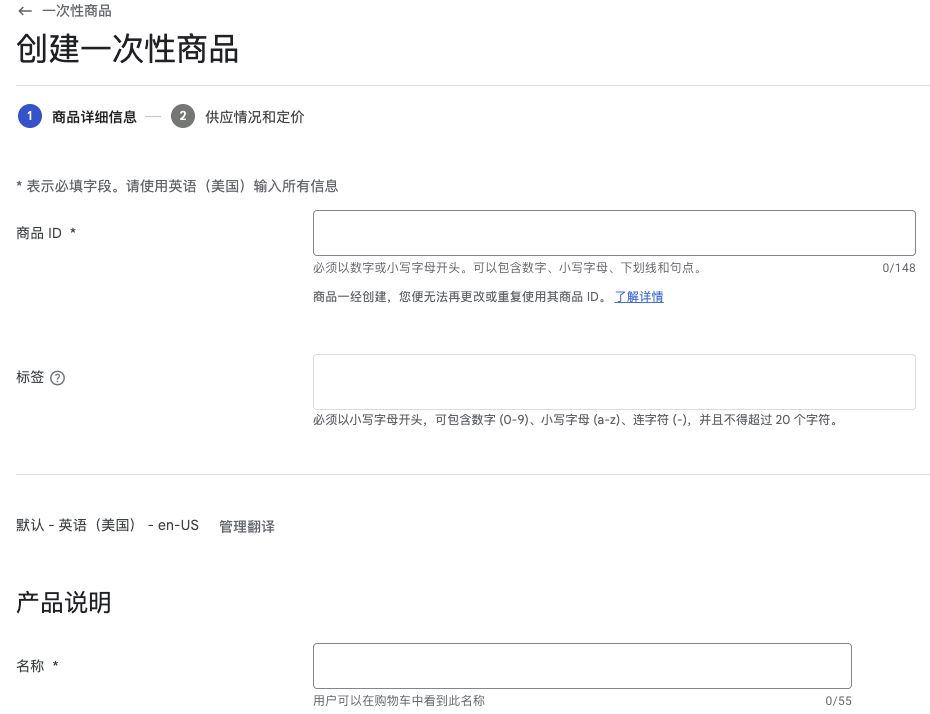
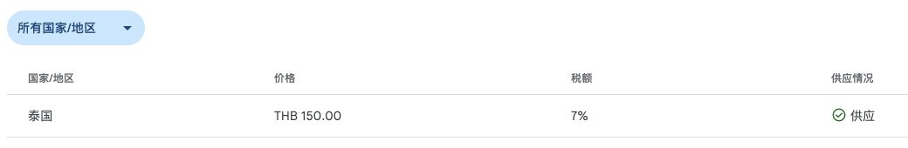
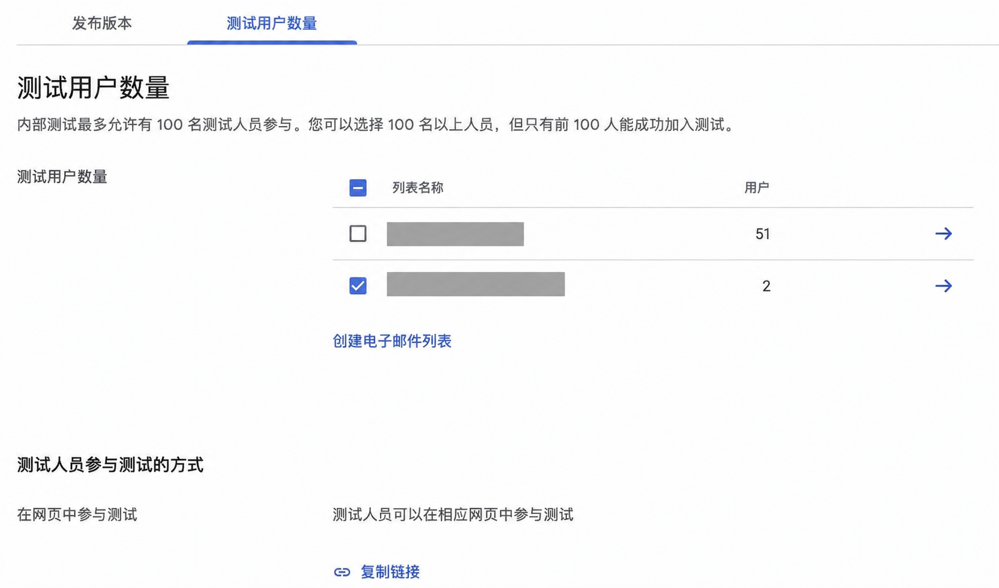
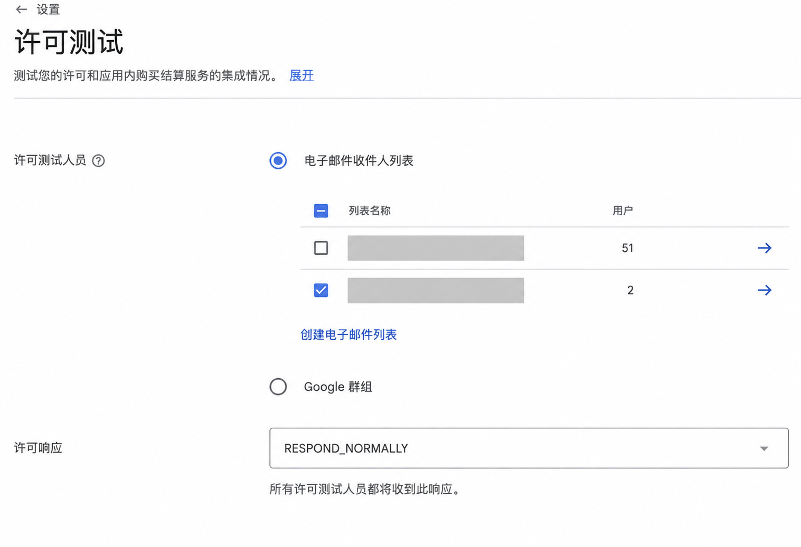
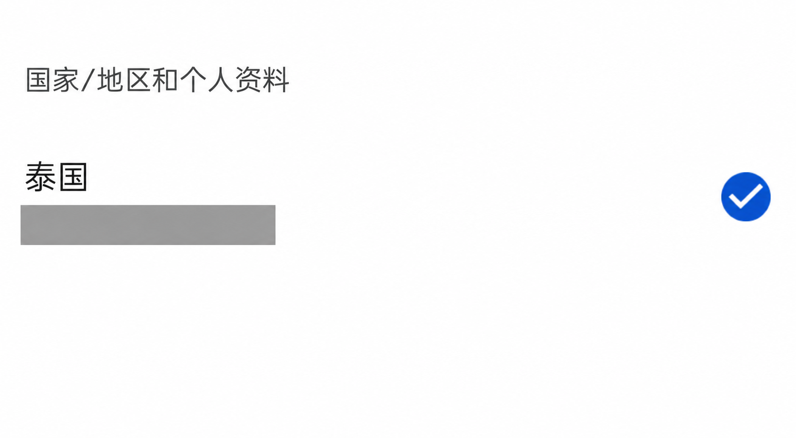
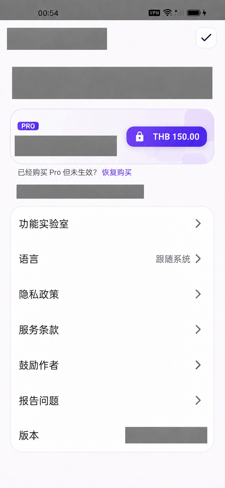
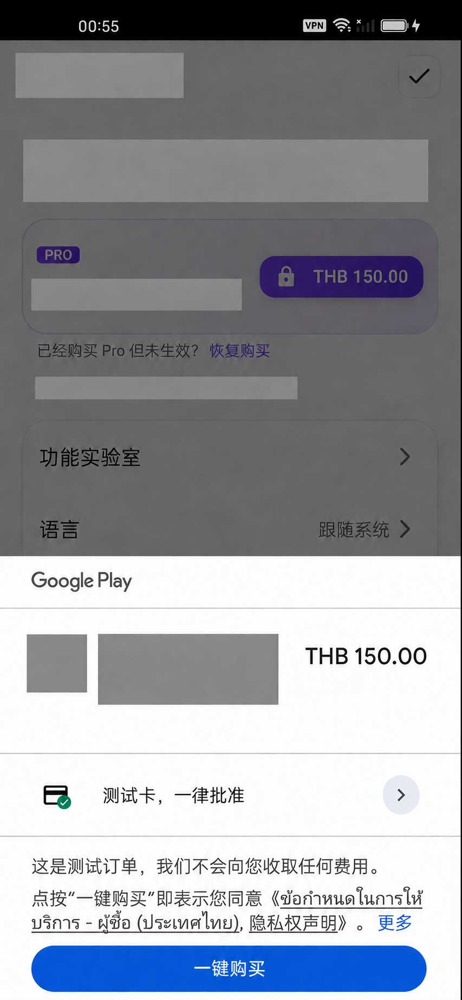
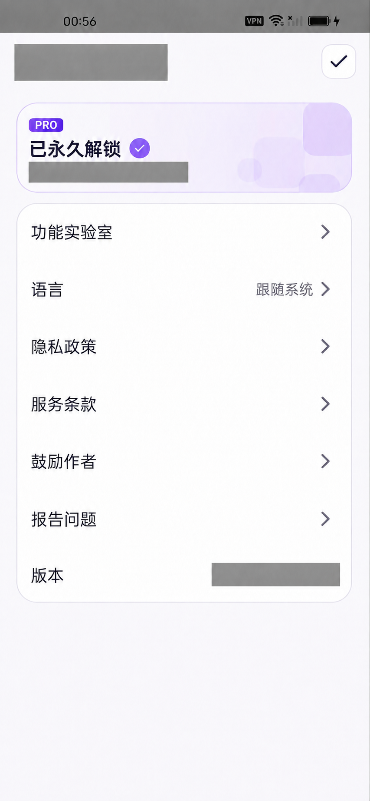
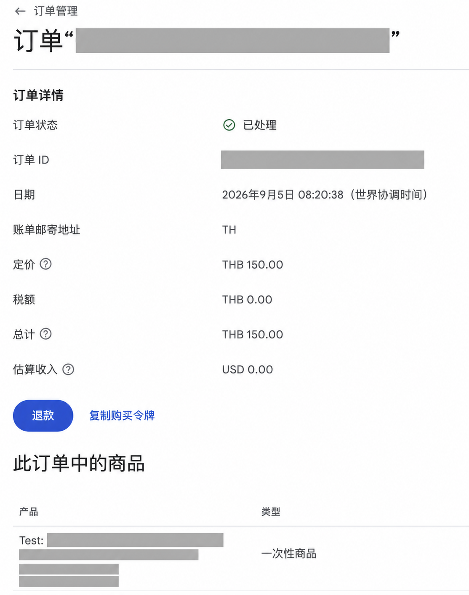

# 独立 App 开发系列：用 AI 接入 Google Play 一次性内购

**阅读时间：约 10 分钟**

**适用读者：** 准备在 Google Play 上架内购、接入支付的 Android 开发者，以及想了解 App 付费流程的独立开发者。

**文章收获：** 一份可直接交给 AI 的接入提示词，商品与测试账号的配置步骤、账号地区的排查方法，以及购买后的权益和订单检查清单。

**一句话总结：** 代码接入可以交给 AI，验收时先核对购买账号及其 Play 地区，再逐项确认价格、购买、权益和后台订单。

## 1. 先把代码接入交给 AI

这次，我给自己的一款 Android App 接入了永久 Pro：用户买一次，就能永久解锁付费功能。接入代码就是用 AI 完成的。

现在做这类接入，依赖配置、商品查询、购买回调、恢复购买、排错和打包，都可以交给编程 AI。你要先说清楚卖什么、买完能获得什么，再按下面的步骤检查结果。

比如“买一次，永久解锁某项功能”，对应的是**非消耗型一次性商品**。如果你做的也是这种付费方式，可以把这段提示词复制给 AI，把商品 ID 和权益换成自己的。

```text
请阅读当前 Android 项目，按现有架构接入 Google Play 非消耗型一次性内购。

商品 ID：pro_lifetime（示例，请替换）。权益：一次购买，永久解锁指定的付费功能，请按项目实际需求填写。

查阅最新官方文档，完成当地价格展示、购买校验与确认、取消/失败/等待付款、重启与恢复购买，以及退款撤销后的状态同步。只有校验通过且付款完成才解锁，不能只靠本地标记。

请直接实施，运行相关检查并生成测试 AAB，列出我需要完成的后台配置和真机验收步骤，说明哪些已验证、哪些待验证。
```

## 2. 上传测试包，打开商品入口

进入 [Google Play Console 开发者后台](https://play.google.com/console/)，选择你的应用。

打开 **测试和发布 → 测试 → 内部测试 → 发布版本**，创建新的发布版本，上传 AI 生成的 AAB。

如果“一次性商品”页面提示先上传包含 Billing 权限的安装包，就让 AI 检查新包的最终清单是否包含 `com.android.vending.BILLING`，并核对上传的确实是这个新包。只改本地代码，后台识别到的安装包不会随之更新。

等 Google 处理完包，再打开 **借助 Play 变现 → 商品 → 一次性商品 → 创建一次性商品**。



## 3. 配好商品、购买选项和销售地区

按创建表单依次填写：

1. **商品 ID**：与代码查询的 ID 逐字一致。这里不要填应用包名；商品 ID 创建后不能再改。
2. **名称和说明**：告诉用户买到什么，例如“永久 Pro”“一次购买，永久解锁 Pro 功能”。
3. **购买选项**：永久解锁选择“购买”，填写购买选项 ID，再设置价格和销售地区。
4. **状态**：完成创建后，检查商品和购买选项是否已启用，测试账号所在地区是否可购买。

例如，美国地区定价为 3.99 美元后，还要核对其他地区生成的当地价格。

进入商品的 **购买选项和优惠**，打开对应购买选项，在 **供应情况和定价** 中查测试账号所在地区。下面这条泰国记录显示价格为 THB 150.00，供应状态为“供应”。



App 应展示 Google Play 返回的当地价格，不要在按钮里写死“3.99 美元”。

## 4. 两份测试名单都要配置

**内部测试名单管安装资格，许可测试名单管测试付款。** 只配前者，购买时仍可能真的扣钱。

### 内部测试：让账号能装到测试版

在 [Play Console](https://play.google.com/console/) 选择应用，打开 **测试和发布 → 测试 → 内部测试 → 测试用户数量**。

创建电子邮件列表，加入手机上准备用来购买的 Google 账号，勾选这个列表并保存。在“发布版本”中完成内部测试版本的发布。

回到“测试用户数量”，找到底部的 **在网页中参与测试 → 复制链接**。在手机上用同一个 Google 账号打开链接，加入测试，再按页面入口从 Google Play 安装。



### 许可测试：让购买面板出现测试卡

回到 [Play Console](https://play.google.com/console/) 的“所有应用”，打开开发者账号的 **设置 → 许可测试**。

选择包含同一个 Google 账号的电子邮件列表，许可响应保留 `RESPOND_NORMALLY`，保存。



配置是否生效，要到手机上确认：点击购买，Google Play 付款面板应出现测试卡，以及不会收费的测试订单提示。

## 5. 价格一直加载，先查 Play 账号的地区

**这次最大的坑，是最初用了中国大陆地区的账号。** 商品已经启用，App 里却一直拿不到价格。后来换成泰国地区的测试账号，才显示出 THB 150.00，并完成测试购买。

如果你也遇到商品启用了、价格却一直加载，先在手机上检查：

1. 打开 **Google Play 商店 → 右上角头像**，确认当前选中的是准备用来购买的账号。
2. 进入 **设置 → 常规 → 账号和设备偏好设置**。
3. 找到 **国家/地区和个人资料**，查看带勾的当前地区。



再回到 [Play Console](https://play.google.com/console/) 的 **购买选项和优惠 → 对应购买选项 → 供应情况和定价**，确认这个地区有供应，并核对价格。

需要调整 Play 地区时，按 [Google 的地区设置说明](https://support.google.com/googleplay/answer/7431675?hl=zh-Hans) 核对条件：更改地区要求你位于对应国家或地区，并有当地可用的支付方式。

地区核对后，再检查三项：

1. **购买账号**：实际付款的账号是否在内部测试和许可测试两份名单里？多账号手机尤其要检查。Google Play 通常使用下载该应用的账号购买，可在付款面板展开查看。
2. **商品配置**：代码中的商品 ID 是否一致？商品和购买选项是否已启用？
3. **手机上的版本**：是否装到了刚发布的测试版？核对版本号，别只凭桌面图标判断。需要重装时，先确认本地数据是否需要备份。

这些配置确认后，把商品查询的响应码和错误信息交给 AI 继续排查。查询已经失败，界面就应该结束加载并提供重试，不能一直转圈。

价格成功返回后，再与后台该地区的定价核对。例如，这里的泰国地区配置为 THB 150.00，App 应显示同样的币种和金额。



## 6. 购买后，检查权益和后台订单

点击购买，先确认 Google Play 面板显示 **“测试卡，一律批准”**，再完成这笔测试订单。



付款面板显示成功后，回到 App，逐项验证：

- **Pro 是否被识别**：页面应切换到已购买或已解锁状态，购买入口同步更新。
- **付费功能是否可用**：进入本次购买包含的功能，实际完成一次使用流程，检查相应限制是否已经解除。不能只看设置页显示“已购买”。
- **重启后是否仍有效**：强制停止 App，再打开，检查 Pro 状态和上述功能是否保留。



### 再到订单管理核对这笔购买

回到 [Google Play Console](https://play.google.com/console/) 的“所有应用”页面，在左侧打开 **订单管理**。

在 **“输入订单 ID 或电子邮件地址即可搜索”** 中，输入本次购买的订单 ID；也可以用测试账号的完整邮箱查找。找到记录后，点击右侧箭头打开订单详情。

重点核对三项：

- **是不是这笔购买**：订单时间与测试时间对应，商品 ID 和购买选项与本次配置一致。后台时间如果标注“世界协调时间”，要换算后再对照。
- **金额是否一致**：币种和金额应与手机付款面板一致，例如这里的 THB 150.00。
- **订单是否已处理**：成功完成的测试购买应能找到对应记录，并显示“已处理”。如果显示待处理或已退款，继续查看订单的“历史记录”，确认发生了什么。



如果找不到订单，先核对订单 ID、实际购买账号和日期筛选范围，再刷新查询。查找方式见 [Google 的订单管理说明](https://support.google.com/googleplay/android-developer/answer/2741495?hl=zh-Hans)。

如果支付成功但 Pro 没变化，把购买回调、订单校验和权益状态更新的日志交给 AI 检查。App 需要在校验通过、购买状态为 `PURCHASED` 后授予权益，再完成确认购买；等待付款的 `PENDING` 状态不能提前解锁。

测试订单过几分钟又被退款，也要检查有没有漏掉确认购买。Google 的许可测试订单如果未被确认，会在约 3 分钟后自动退款。[购买测试说明](https://developer.android.com/google/play/billing/test)

## 7. 再补测这几种情况

- **取消或付款失败**：不解锁，页面结束等待，用户可以重新发起购买。
- **等待付款**：先显示等待状态；款项完成后才解锁，取消后恢复可购买状态。
- **恢复购买**：用同一购买账号重装或换设备，能够找回已购权益，不要求再次付费。
- **退款并撤销权益**：在后台处理后，让 App 重新同步购买状态，确认付费功能随之更新。

## 写在最后

这次的内购代码是 AI 写的，Google Play 后台也能让它帮着操作。放在以前，光是查文档、找示例、弄明白这些配置，就够折腾一阵。

我现在觉得，做独立开发，见识更重要了。知道有哪些东西能用，能想到拿来做什么，就值得试一次。至于没接过的 SDK、没用过的后台，可以让 AI 一起解决，已经没必要因为这些就把一个想法搁下了。

参考资料：

- [Google Play Billing 集成与购买处理](https://developer.android.com/google/play/billing/integrate)
- [Google Play Billing 测试说明](https://developer.android.com/google/play/billing/test)
- [一次性商品配置说明](https://support.google.com/googleplay/android-developer/answer/16430488)
